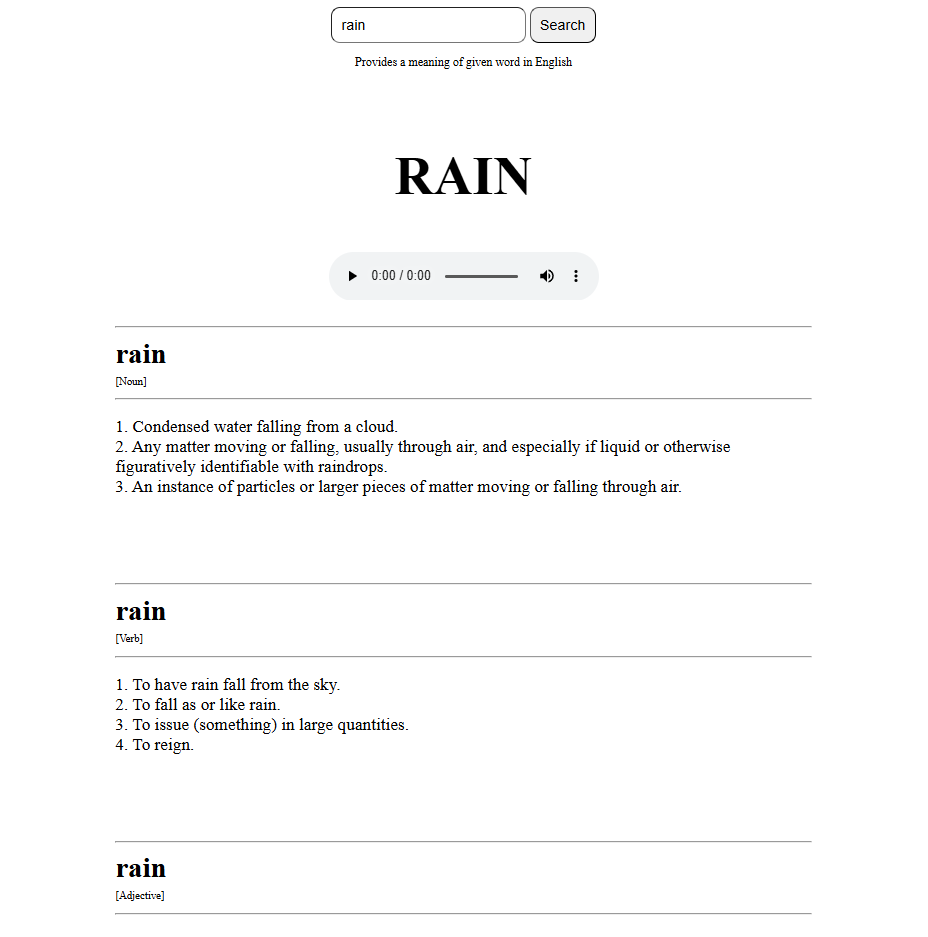
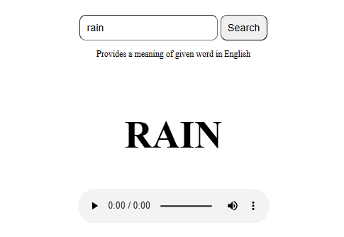

# DictionaryProject

## Project Overview
The Dictionary Project is a very simple web-based dictionary application that uses a <b>public</b> API to fetch word meanings and pronunciation. The application allows users to enter a word in English and receive its definition, along with the option to listen to its pronunciation. This was my first project utilizing an external API, and it includes basic API integration, handling JSON responses, and displaying dynamic content.

### Features
* Word Search: Enter an English word to fetch its definition (certain words are not available, it depends on the API)
* Pronunciation: Listen to the pronunciation of the word using the voice feature
* Word Categories: The word's meaning is displayed, including its part of speech (e.g., noun, adjective)
* API Integration: Uses a public dictionary API to fetch real-time data

## Installation
Steps to set up and run this project locally are very simple:

### Frontend
1. Clone the repository:
```
git clone https://github.com/husejn09/dictionary_projekt.git
```

2. Navigate to the project folder in VS code and:
* Right click on index.html and select Open with live server (check if you have that extension installed)

## Usage
* Enter a word in the search bar and click search
* The app fetches data from a public API and displays the relevant information
* Click to listen to pronunciation and read definitions

## Screenshots

* Enter a word and get its meaning


* Click the icon to hear the pronunciation of the word


## License
This project is licensed under the MIT License - see the [LICENSE](/LICENSE) file for details.
